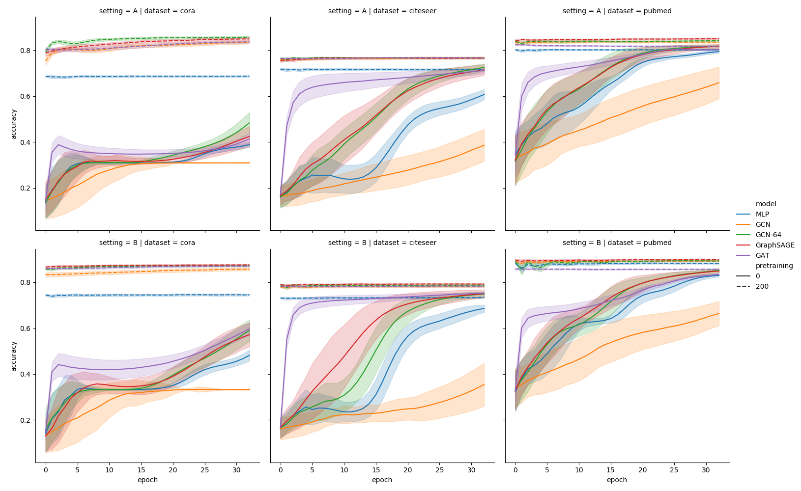

# Code for evaluating graph neural nets with unseen nodes after pretraining

**Paper:** L Galke, I Vagliano, A Scherp: *Can Graph Neural Networks Go "Online"? An Analysis of Pretraining and Inference*, RLGM@ICLR2019.

A link to the paper will follow soon.



## Requirements

For the evaluate script: python3, torch, dgl, pandas
For the visualization script: matplotlib, seaborn


```sh
pip install -r requirements.txt
```

## Reproducing our experiments

We provide a convenience script for re-generating all the results from the paper.

```sh
./trigger.bash
```

## Running own experiments

The pretraining/inference experiments can be conducted with the `evaluate.py` script

```sh
usage: evaluate.py [-h] [--dataset DATASET]
			[--model MODEL]
			[--runs RUNS]
			[--inference INFERENCE]
                   	[--invert]
			[--outfile OUTFILE]
			[--epochs EPOCHS]
                   	[--no-cuda]
			[--info]

optional arguments:
  -h, --help            show this help message and exit
  --dataset DATASET     The input dataset.
  --model MODEL         Specify model
  --runs RUNS           Number of random reruns
  --inference INFERENCE
                        Number of inference epochs
  --invert              Invert train and test set
  --outfile OUTFILE     Dump Results to outfile
  --epochs EPOCHS       Number of training epochs
  --no-cuda             Force no cuda
```

For batching experiments, see the example in `trigger.bash`

## Visualizing results

We provide a script to visualize the results generated by `evaluate.py`.
The script should be called on the results file specified by `--outfile`:

```sh
python3 visualize.py results.txt`
```

## Adding new models

New models should be implemented as subclasses of `nn.Module` and implement
`forward` as `forward(features)`, where `features` are the node features. They
additionally need to satisfy `set_graph(g)`, where `g` is a `DGLGraph`
instance.  This method will be called between the pretraining and the inference
epochs.  They need to be registered along with hyperparameters and optimizers
in the `factory.py`.
